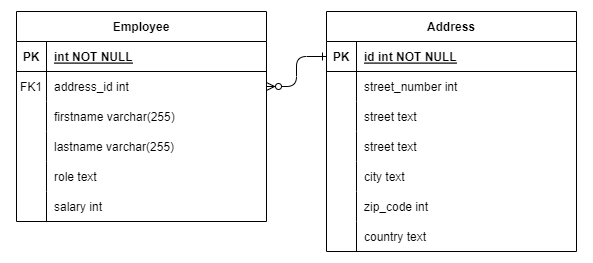

# employee-crud

## Getting Started
`npm run dev`

## Description
A ReactJS SPA that performs CRUD operations against a MySQL database.

## Database ERD

## Requirements
**Frontend**
1. useEffect hooks for synchronizing data but event management for side effects.
2. Asynchronous, non-blocking code.
3. Streams API.
4. Class and Functional Components.
5. Routing.
6. Higher Order Components.
7. External Libraries.
8. CSS.

**Backend**
1. Stubbed out.

**Bonus**
1. TypeScript.

## API
| Method | Urls | Actions |
| ----------- | ----------- | ----------- |
| `GET` | /employees | Get all Employees |
| `POST` | /employees | Add new Employee |
| `DELETE` | /employees | Remove all Employee |
| `GET` | /employees/:id | Get Employee by `id` |
| `PUT` | /employees/:id | Update an Employee |
| `DELETE` | /employees/:id | Remove an Employee |
<!-- | `GET` | /employees/manager | Find all Employees with the manager role |
| `GET` | /employees/?role=[] | Find all Employees with the manager role | -->
